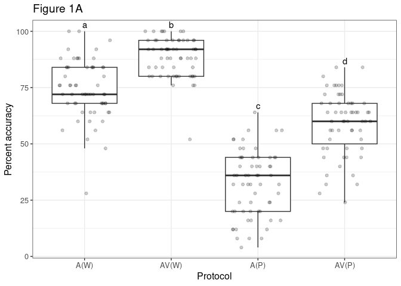

Importance of Visual Support Through Lipreading in the Identification of
Words in Spanish Language
================
Violeta Gómez-Vicente, Gema Esquiva, Carmen Lancho, Kawthar Benzerdjeb,
Antonia Angulo Jerez and Eva Ausó

``` r
## Libraries
library(dplyr)
library(ggplot2)
library(lme4)
library(lmerTest)
library(tidyverse)
library(emmeans)
library(optimx)
library(ggsignif)
library(car)
```

## Dataset

A cross-sectional observational study was conducted with normal-hearing
young and old adult volunteers of two genders, males and females, in
which we assessed the degree of discrimination of words and phonemes
following two protocols: auditory-only (*A*) and audiovisual (*AV*)
modalities. The study involved 65 participants, from 18 to 65 years of
age. The sample as divided into four groups according to age (18-29,
30-39, 40-49 and ≥ 50 years). The sample was considered representative
of a larger normal-hearing population. All participants belonged to the
University of Alicante community and included undergraduate and master’s
students, as well as teaching/research and administrative staff, who
were recruited between February 2021 and June 2021 in Alicante, Spain.
Eligible subjects were contacted by email with the assistance of the
Faculties of Sciences and Health Sciences, who spread the message
requesting participation among their members. Inclusion criteria were a
minimum age of 18 years, bilateral normal hearing, normal or corrected
vision, no prior training in speechreading fluency in Spanish language
(native speakers), and non-existence of neurological or language-related
disorders. Exclusion criteria were not meeting the inclusion criteria.
The study took place at the Audiology Laboratory of the University of
Alicante. An informed written consent was obtained from all participants
and the study was approved by the University Ethics Committee (approval
number UA-2021-02-12) and conducted in accordance with the Declaration
of Helsinki.

The dataset contains the following variables:

-   Subject: ID of the different volunteers
-   Age: categorical variable with 4 categories (18-29, 30-39, 40-49 and
    ≥ 50 years)
-   Sex: categorical variable with 2 categories (female, male)
-   Protocol: categorical variable with two categories (auditory-only
    *A*, audiovisual *AV*)
-   Word_Phoneme: categorical variable with two categories (word *W*,
    phoneme *P*)
-   Hit_Percentage: percentage of hit over the phonemes and word tested
-   Type_Protocol_WP: combination of the categorical variables
    *Protocol* and *Word_Phoneme*. It has four categories: words with
    auditory-only *A(W)*, phonemes with auditory-only *A(P)*, words with
    audiovisual *AV(W)*, phonemes with audiovisual *AV(P)*.

There are 4 values of hit percentage per subject, each of them
corresponding to the levels of the variable *Type_Protocol_WP*. In
addition, there are some missing observations.

To analyze if there exists significant differences between the
categories of *Type_Protocol_WP*, how are these differences when
including the sex or the age factor and to know which is the audiovisual
benefit between words and phonemes generalized and linear mixed-effects
model (GLMEM and LMEM) will be employed. In particular, the maximal
random-effect structure is contemplated to take into account the
variability associated with the selection of words and phonemes that
subjects hear.

## Percentage of hits and percentage of hits by gender and age

Given that some of the instances present missing values, a complete
maximal mixed-effects model cannot be considered since the number of
random effects is greater than the number of observations. Thus, only
the random intercept will be included. Seeking to have robust models
with the minimum no significant factors, the triple interaction with
*Type_Protocol_WP*, *Sex* and *Age* is not considered (this interactions
implies 32 factors in the model). Hence, two models are fitted: one
considering the interaction between *Type_Protocol_WP* and *Sex* and one
with the interaction between *Type_Protocol_WP* and *Age*. The code of
both models is now presented:

``` r
datos = datos %>% mutate(target = Hit_Percentage/100)
datos$weights_v = rep(25,dim(datos)[1])
datos_aux = na.omit(datos)

# Model including the interaction with Sex
m1a = glmer(target ~ 1 + Type_Protocol_WP*Sex + Age +
              (1 | Subject), datos_aux,
            family = binomial, weights = weights_v,glmerControl(optimizer ='optimx', optCtrl=list(method='nlminb')))


# Model including the interaction with Age
m1a_age = glmer(target ~ 1 + Type_Protocol_WP*Age + Sex +
              (1 | Subject), datos_aux,
            family = binomial, weights = weights_v,glmerControl(optimizer ='optimx', optCtrl=list(method='nlminb')))
```

Summary of the model including the interaction between
*Type_Protocol_WP* and *Sex*:

``` r
summary(m1a)
```

    ## Generalized linear mixed model fit by maximum likelihood (Laplace
    ##   Approximation) [glmerMod]
    ##  Family: binomial  ( logit )
    ## Formula: target ~ 1 + Type_Protocol_WP * Sex + Age + (1 | Subject)
    ##    Data: datos_aux
    ## Weights: weights_v
    ## Control: glmerControl(optimizer = "optimx", optCtrl = list(method = "nlminb"))
    ## 
    ##      AIC      BIC   logLik deviance df.resid 
    ##   1159.8   1201.5   -567.9   1135.8      227 
    ## 
    ## Scaled residuals: 
    ##     Min      1Q  Median      3Q     Max 
    ## -4.2438 -0.6143  0.0154  0.6229  2.5204 
    ## 
    ## Random effects:
    ##  Groups  Name        Variance Std.Dev.
    ##  Subject (Intercept) 0.1772   0.421   
    ## Number of obs: 239, groups:  Subject, 62
    ## 
    ## Fixed effects:
    ##                               Estimate Std. Error z value Pr(>|z|)    
    ## (Intercept)                   -0.64185    0.14267  -4.499 6.83e-06 ***
    ## Type_Protocol_WPA(W)           1.99440    0.11337  17.593  < 2e-16 ***
    ## Type_Protocol_WPAV(P)          1.18765    0.10605  11.199  < 2e-16 ***
    ## Type_Protocol_WPAV(W)          3.11599    0.14514  21.468  < 2e-16 ***
    ## SexMale                       -0.04773    0.15718  -0.304   0.7614    
    ## Age30-39                      -0.09998    0.18099  -0.552   0.5807    
    ## Age40-49                       0.02769    0.17403   0.159   0.8736    
    ## Age≥50                        -0.33226    0.16862  -1.970   0.0488 *  
    ## Type_Protocol_WPA(W):SexMale  -0.28073    0.16675  -1.684   0.0923 .  
    ## Type_Protocol_WPAV(P):SexMale -0.08444    0.15720  -0.537   0.5912    
    ## Type_Protocol_WPAV(W):SexMale -0.47923    0.20267  -2.365   0.0181 *  
    ## ---
    ## Signif. codes:  0 '***' 0.001 '**' 0.01 '*' 0.05 '.' 0.1 ' ' 1
    ## 
    ## Correlation of Fixed Effects:
    ##              (Intr) Ty_P_WPA(W) Ty_P_WPAV(P) Ty_P_WPAV(W) SexMal A30-39 A40-49
    ## Ty_P_WPA(W)  -0.366                                                           
    ## Ty_P_WPAV(P) -0.366  0.479                                                    
    ## Ty_P_WPAV(W) -0.273  0.361       0.376                                        
    ## SexMale      -0.433  0.328       0.344        0.254                           
    ## Age30-39     -0.514  0.003      -0.014       -0.009       -0.100              
    ## Age40-49     -0.573  0.014      -0.007        0.002       -0.022  0.460       
    ## Age≥50       -0.551 -0.004      -0.019       -0.018       -0.101  0.488  0.494
    ## T_P_WPA(W):   0.253 -0.677      -0.325       -0.243       -0.488 -0.008 -0.008
    ## T_P_WPAV(P):  0.244 -0.321      -0.674       -0.251       -0.515  0.012  0.014
    ## T_P_WPAV(W):  0.199 -0.256      -0.268       -0.713       -0.401  0.001  0.001
    ##              Age≥50 T_P_WPA(W): T_P_WPAV(P):
    ## Ty_P_WPA(W)                                 
    ## Ty_P_WPAV(P)                                
    ## Ty_P_WPAV(W)                                
    ## SexMale                                     
    ## Age30-39                                    
    ## Age40-49                                    
    ## Age≥50                                      
    ## T_P_WPA(W):  -0.011                         
    ## T_P_WPAV(P):  0.010  0.487                  
    ## T_P_WPAV(W): -0.002  0.390       0.403

Confidence intervals:

``` r
# Confidence intervals:
emm = emmeans(m1a, ~ Type_Protocol_WP,type = 'response',df = df.residual(m1a))
emm
```

    ##  Type_Protocol_WP  prob      SE  df lower.CL upper.CL
    ##  A(P)             0.317 0.01695 227    0.285    0.351
    ##  A(W)             0.748 0.01540 227    0.716    0.777
    ##  AV(P)            0.594 0.01860 227    0.556    0.630
    ##  AV(W)            0.892 0.00966 227    0.871    0.909
    ## 
    ## Results are averaged over the levels of: Sex, Age 
    ## Degrees-of-freedom method: user-specified 
    ## Confidence level used: 0.95 
    ## Intervals are back-transformed from the logit scale

There exists significant differences among all the categories of
*Type_Protocol_WP* (p-value \<.0001 in all cases).

``` r
# Multiple comparisons 
pairs(emm)
```

    ##  contrast      odds.ratio      SE  df null t.ratio p.value
    ##  A(P) / A(W)       0.1566 0.01310 227    1 -22.166  <.0001
    ##  A(P) / AV(P)      0.3181 0.02504 227    1 -14.553  <.0001
    ##  A(P) / AV(W)      0.0563 0.00573 227    1 -28.263  <.0001
    ##  A(W) / AV(P)      2.0312 0.16682 227    1   8.628  <.0001
    ##  A(W) / AV(W)      0.3598 0.03709 227    1  -9.916  <.0001
    ##  AV(P) / AV(W)     0.1771 0.01775 227    1 -17.268  <.0001
    ## 
    ## Results are averaged over the levels of: Sex, Age 
    ## Degrees-of-freedom method: user-specified 
    ## P value adjustment: tukey method for comparing a family of 4 estimates 
    ## Tests are performed on the log odds ratio scale

Next, the figure 1A is plotted adding the detail (with letters a, b, c,
d) of the significant differences among categories:

``` r
##  Figure 1 A
datos$Type_Protocol_WP <- factor(datos$Type_Protocol_WP , levels=c("A(W)", "AV(W)","A(P)", "AV(P)"))
datos.summarized = datos %>% group_by(Type_Protocol_WP) %>% summarize(Max_value=max(Hit_Percentage,na.rm = TRUE))
signi_letters = c('a','b','c','d') # based on the previous multiple comparisons


ggplot(datos, aes(x = Type_Protocol_WP, y = Hit_Percentage)) + 
  geom_boxplot() + ggtitle("Figure 1A") +
  xlab("Protocol") + ylab("% of hits")  + theme_bw() +
  theme(text = element_text(size=16)) +
  geom_text(data=datos.summarized,
           aes(x=Type_Protocol_WP,y=0.2+Max_value,label=signi_letters),vjust=-0.5)
```

<!-- -->

The following chunk obtains the confidence intervals of each sex
(female, male) inside the categories *A(W)*, *AV(W)*,*A(P)*, *AV(P)*.

``` r
# Confidence intervals 
emm = emmeans(m1a, ~ Type_Protocol_WP*Sex, by = 'Type_Protocol_WP', type = 'response',
              df = df.residual(m1a))
emm
```

    ## Type_Protocol_WP = A(P):
    ##  Sex     prob     SE  df lower.CL upper.CL
    ##  Female 0.322 0.0231 227    0.279    0.369
    ##  Male   0.312 0.0249 227    0.265    0.363
    ## 
    ## Type_Protocol_WP = A(W):
    ##  Sex     prob     SE  df lower.CL upper.CL
    ##  Female 0.778 0.0192 227    0.737    0.813
    ##  Male   0.716 0.0245 227    0.665    0.761
    ## 
    ## Type_Protocol_WP = AV(P):
    ##  Sex     prob     SE  df lower.CL upper.CL
    ##  Female 0.609 0.0249 227    0.559    0.657
    ##  Male   0.577 0.0277 227    0.522    0.631
    ## 
    ## Type_Protocol_WP = AV(W):
    ##  Sex     prob     SE  df lower.CL upper.CL
    ##  Female 0.915 0.0112 227    0.890    0.934
    ##  Male   0.864 0.0165 227    0.828    0.893
    ## 
    ## Results are averaged over the levels of: Age 
    ## Degrees-of-freedom method: user-specified 
    ## Confidence level used: 0.95 
    ## Intervals are back-transformed from the logit scale

The multiple comparisons analysis reveals that there are significant
differences between the hit percentage of females and males in the
category *A(W)* (p-value = 0.0465) and in the category *AV(W)* (p-value
= 0.0092).

``` r
# Multiple comparisons 
pairs(emm)
```

    ## Type_Protocol_WP = A(P):
    ##  contrast      odds.ratio    SE  df null t.ratio p.value
    ##  Female / Male       1.05 0.165 227    1   0.304  0.7617
    ## 
    ## Type_Protocol_WP = A(W):
    ##  contrast      odds.ratio    SE  df null t.ratio p.value
    ##  Female / Male       1.39 0.228 227    1   2.002  0.0465
    ## 
    ## Type_Protocol_WP = AV(P):
    ##  contrast      odds.ratio    SE  df null t.ratio p.value
    ##  Female / Male       1.14 0.177 227    1   0.854  0.3942
    ## 
    ## Type_Protocol_WP = AV(W):
    ##  contrast      odds.ratio    SE  df null t.ratio p.value
    ##  Female / Male       1.69 0.340 227    1   2.628  0.0092
    ## 
    ## Results are averaged over the levels of: Age 
    ## Degrees-of-freedom method: user-specified 
    ## Tests are performed on the log odds ratio scale

The two following plot helps in the comparion of the sex levels in the
categories of *Type_Protocol_WP*.

``` r
# Boxplot
ggplot(datos, aes(x = Type_Protocol_WP, y = Hit_Percentage,
                  fill = Sex)) + 
  geom_boxplot() + ggtitle("Figure 2") +
  xlab("Protocol") + ylab("% of hits")  + theme_bw() +
  theme(text = element_text(size=16)) +
  scale_fill_grey(start=0.8, end=0.6) +
  geom_signif(annotation = "✳",
              y_position = 105, xmin = 0.81, xmax = 1.19, 
              tip_length = 0.01) +
  geom_signif(annotation = "✳",
              y_position = 105, xmin = 1.81, xmax = 2.19, 
              tip_length = 0.01)
```

<!-- -->

To analyze the effect of the age, the model considering the interaction
with age is used. First, a summary of the model is presented.

``` r
summary(m1a_age)
```

    ## Generalized linear mixed model fit by maximum likelihood (Laplace
    ##   Approximation) [glmerMod]
    ##  Family: binomial  ( logit )
    ## Formula: target ~ 1 + Type_Protocol_WP * Age + Sex + (1 | Subject)
    ##    Data: datos_aux
    ## Weights: weights_v
    ## Control: glmerControl(optimizer = "optimx", optCtrl = list(method = "nlminb"))
    ## 
    ##      AIC      BIC   logLik deviance df.resid 
    ##   1165.7   1228.3   -564.9   1129.7      221 
    ## 
    ## Scaled residuals: 
    ##     Min      1Q  Median      3Q     Max 
    ## -4.8060 -0.5783 -0.0235  0.6755  2.4838 
    ## 
    ## Random effects:
    ##  Groups  Name        Variance Std.Dev.
    ##  Subject (Intercept) 0.1764   0.42    
    ## Number of obs: 239, groups:  Subject, 62
    ## 
    ## Fixed effects:
    ##                                Estimate Std. Error z value Pr(>|z|)    
    ## (Intercept)                    -0.69363    0.15709  -4.416 1.01e-05 ***
    ## Type_Protocol_WPA(W)            2.20378    0.17153  12.848  < 2e-16 ***
    ## Type_Protocol_WPAV(P)           1.22060    0.15461   7.895 2.91e-15 ***
    ## Type_Protocol_WPAV(W)           3.04827    0.21117  14.435  < 2e-16 ***
    ## Age30-39                       -0.10220    0.22831  -0.448   0.6544    
    ## Age40-49                        0.24835    0.21507   1.155   0.2482    
    ## Age≥50                         -0.09082    0.21269  -0.427   0.6694    
    ## SexMale                        -0.20401    0.12547  -1.626   0.1040    
    ## Type_Protocol_WPA(W):Age30-39  -0.31561    0.24663  -1.280   0.2007    
    ## Type_Protocol_WPAV(P):Age30-39  0.24257    0.23064   1.052   0.2929    
    ## Type_Protocol_WPAV(W):Age30-39 -0.02106    0.30270  -0.070   0.9445    
    ## Type_Protocol_WPA(W):Age40-49  -0.41993    0.24179  -1.737   0.0824 .  
    ## Type_Protocol_WPAV(P):Age40-49 -0.30516    0.21990  -1.388   0.1652    
    ## Type_Protocol_WPAV(W):Age40-49 -0.21232    0.30154  -0.704   0.4814    
    ## Type_Protocol_WPA(W):Age≥50    -0.54380    0.22910  -2.374   0.0176 *  
    ## Type_Protocol_WPAV(P):Age≥50   -0.18389    0.21361  -0.861   0.3893    
    ## Type_Protocol_WPAV(W):Age≥50   -0.35651    0.27493  -1.297   0.1947    
    ## ---
    ## Signif. codes:  0 '***' 0.001 '**' 0.01 '*' 0.05 '.' 0.1 ' ' 1

The confidence intervals of each age category inside the categories
*A(W)*, *AV(W)*,*A(P)*, *AV(P)* are:

``` r
# Confidence intervals 
emm = emmeans(m1a_age, ~ Type_Protocol_WP*Age, by = 'Type_Protocol_WP', type = 'response',
              df = df.residual(m1a_age))
emm
```

    ## Type_Protocol_WP = A(P):
    ##  Age    prob     SE  df lower.CL upper.CL
    ##  18-29 0.311 0.0325 221    0.251    0.378
    ##  30-39 0.289 0.0350 221    0.226    0.363
    ##  40-49 0.366 0.0358 221    0.299    0.439
    ##  ≥50   0.292 0.0308 221    0.235    0.356
    ## 
    ## Type_Protocol_WP = A(W):
    ##  Age    prob     SE  df lower.CL upper.CL
    ##  18-29 0.803 0.0263 221    0.747    0.850
    ##  30-39 0.729 0.0339 221    0.657    0.791
    ##  40-49 0.775 0.0298 221    0.711    0.828
    ##  ≥50   0.684 0.0318 221    0.619    0.743
    ## 
    ## Type_Protocol_WP = AV(P):
    ##  Age    prob     SE  df lower.CL upper.CL
    ##  18-29 0.605 0.0363 221    0.531    0.674
    ##  30-39 0.638 0.0382 221    0.560    0.709
    ##  40-49 0.591 0.0379 221    0.515    0.663
    ##  ≥50   0.537 0.0354 221    0.467    0.606
    ## 
    ## Type_Protocol_WP = AV(W):
    ##  Age    prob     SE  df lower.CL upper.CL
    ##  18-29 0.905 0.0180 221    0.863    0.935
    ##  30-39 0.894 0.0201 221    0.847    0.927
    ##  40-49 0.908 0.0180 221    0.866    0.938
    ##  ≥50   0.859 0.0208 221    0.813    0.895
    ## 
    ## Results are averaged over the levels of: Sex 
    ## Degrees-of-freedom method: user-specified 
    ## Confidence level used: 0.95 
    ## Intervals are back-transformed from the logit scale

The multiple comparisons analysis shows that there are only significant
differences between the hit percentage of the category (18-29) and ≥50
in the category *A(W)* (p-value = 0.0243).

``` r
# Multiple comparisons 
pairs(emm)
```

    ## Type_Protocol_WP = A(P):
    ##  contrast          odds.ratio    SE  df null t.ratio p.value
    ##  (18-29) / (30-39)      1.108 0.253 221    1   0.448  0.9700
    ##  (18-29) / (40-49)      0.780 0.168 221    1  -1.155  0.6560
    ##  (18-29) / ≥50          1.095 0.233 221    1   0.427  0.9738
    ##  (30-39) / (40-49)      0.704 0.162 221    1  -1.524  0.4247
    ##  (30-39) / ≥50          0.989 0.224 221    1  -0.050  1.0000
    ##  (40-49) / ≥50          1.404 0.301 221    1   1.581  0.3915
    ## 
    ## Type_Protocol_WP = A(W):
    ##  contrast          odds.ratio    SE  df null t.ratio p.value
    ##  (18-29) / (30-39)      1.519 0.364 221    1   1.745  0.3032
    ##  (18-29) / (40-49)      1.187 0.282 221    1   0.723  0.8878
    ##  (18-29) / ≥50          1.886 0.419 221    1   2.854  0.0243
    ##  (30-39) / (40-49)      0.782 0.189 221    1  -1.016  0.7403
    ##  (30-39) / ≥50          1.242 0.281 221    1   0.959  0.7726
    ##  (40-49) / ≥50          1.589 0.358 221    1   2.053  0.1720
    ## 
    ## Type_Protocol_WP = AV(P):
    ##  contrast          odds.ratio    SE  df null t.ratio p.value
    ##  (18-29) / (30-39)      0.869 0.195 221    1  -0.624  0.9243
    ##  (18-29) / (40-49)      1.058 0.230 221    1   0.262  0.9937
    ##  (18-29) / ≥50          1.316 0.274 221    1   1.317  0.5528
    ##  (30-39) / (40-49)      1.218 0.278 221    1   0.864  0.8233
    ##  (30-39) / ≥50          1.514 0.331 221    1   1.901  0.2304
    ##  (40-49) / ≥50          1.243 0.264 221    1   1.028  0.7335
    ## 
    ## Type_Protocol_WP = AV(W):
    ##  contrast          odds.ratio    SE  df null t.ratio p.value
    ##  (18-29) / (30-39)      1.131 0.337 221    1   0.414  0.9761
    ##  (18-29) / (40-49)      0.965 0.289 221    1  -0.120  0.9994
    ##  (18-29) / ≥50          1.564 0.423 221    1   1.653  0.3510
    ##  (30-39) / (40-49)      0.853 0.258 221    1  -0.527  0.9525
    ##  (30-39) / ≥50          1.383 0.377 221    1   1.189  0.6346
    ##  (40-49) / ≥50          1.622 0.447 221    1   1.755  0.2983
    ## 
    ## Results are averaged over the levels of: Sex 
    ## Degrees-of-freedom method: user-specified 
    ## P value adjustment: tukey method for comparing a family of 4 estimates 
    ## Tests are performed on the log odds ratio scale

The two following plot helps in the comparion of the age levels in the
categories of *Type_Protocol_WP*.

``` r
# Boxplot
ggplot(datos, aes(x = Type_Protocol_WP, y = Hit_Percentage,
                  fill = Age)) + 
  geom_boxplot() + ggtitle("Figure 3") +
  xlab("Protocol") + ylab("% of hits")   + theme_bw() +
  theme(text = element_text(size=16)) +
  scale_fill_grey(start=0.85, end=0.38) +
  geom_signif(annotation = "✳",
              y_position = 105, xmin = 0.71, xmax = 1.29, 
              tip_length = 0.01) 
```

<!-- -->

Finally, we check the residuals of the two employed models. In both
cases, all the conditions are fulfilled.

``` r
### Residual Checks for the model with sex interaction
plot(fitted(m1a), resid(m1a, type = "pearson"))
abline(0,0, col="red")
```

<!-- -->

``` r
qqnorm(resid(m1a)) 
qqline(resid(m1a), col = "red") 
```

<!-- -->

``` r
# random intercept subject
qqnorm(ranef(m1a)$Subject[,1] )
qqline(ranef(m1a)$Subject[,1], col = "red")
```

<!-- -->

``` r
### Residual Checks for the model with age interaction
plot(fitted(m1a_age), resid(m1a_age, type = "pearson"))
abline(0,0, col="red")
```

<!-- -->

``` r
qqnorm(resid(m1a_age)) 
qqline(resid(m1a_age), col = "red") 
```

<!-- -->

``` r
# random intercept subject
qqnorm(ranef(m1a_age)$Subject[,1] )
qqline(ranef(m1a_age)$Subject[,1], col = "red")
```

<!-- -->

## Audiovisual benefit

We analyze if there is significant differences between the Audiovisual
(AV) benefit in the word (W) and phoneme (P) categories. AV benefit was
gauged as the difference in the percentage of hits in the two lists
(words and phonemes) between AV and A modalities. First, a linear
mixed-effects model is tested. If the hypothesis (normality and
homoscedasticity of the residuals) are not fulfilled, a non-parametric
model will be employed.

Given that some of the instances present missing values, a complete
maximal mixed-effects model cannot be considered since the number of
random effects is greater than the number of observations. Thus, only
the random intercept will be included as it can be seen in the following
chunk:

``` r
data_1b = na.omit(datos_av)
m1b = lmer(AV_benefit ~ 1 + Word_Phoneme +
             (1 | Subject) , data_1b) 
summary(m1b)
```

    ## Linear mixed model fit by REML. t-tests use Satterthwaite's method [
    ## lmerModLmerTest]
    ## Formula: AV_benefit ~ 1 + Word_Phoneme + (1 | Subject)
    ##    Data: data_1b
    ## 
    ## REML criterion at convergence: 861.9
    ## 
    ## Scaled residuals: 
    ##     Min      1Q  Median      3Q     Max 
    ## -2.1867 -0.7977 -0.0713  0.5818  3.7326 
    ## 
    ## Random effects:
    ##  Groups   Name        Variance Std.Dev.
    ##  Subject  (Intercept)  15.88    3.985  
    ##  Residual             113.35   10.647  
    ## Number of obs: 113, groups:  Subject, 61
    ## 
    ## Fixed effects:
    ##               Estimate Std. Error      df t value Pr(>|t|)    
    ## (Intercept)     16.182      1.546 110.107  10.469  < 2e-16 ***
    ## Word_PhonemeP   10.360      2.015  56.397   5.142 3.54e-06 ***
    ## ---
    ## Signif. codes:  0 '***' 0.001 '**' 0.01 '*' 0.05 '.' 0.1 ' ' 1
    ## 
    ## Correlation of Fixed Effects:
    ##             (Intr)
    ## Word_PhonmP -0.684

Next, the residuals check is performed. The normality of the residuals
and of the random intercept is fulfilled. Besides, the homoscedasticity
is also satisfied as the residual graph and the Levene test show.

``` r
# homoscedasticity
plot(fitted(m1b), resid(m1b, type = "pearson"))
abline(0,0, col="red")
```

<!-- -->

``` r
leveneTest(residuals(m1b) ~ data_1b$Word_Phoneme)
```

    ## Levene's Test for Homogeneity of Variance (center = median)
    ##        Df F value Pr(>F)
    ## group   1  0.0298 0.8632
    ##       111

``` r
# Normality of residuals
qqnorm(resid(m1b)) 
qqline(resid(m1b), col = "red") 
```

<!-- -->

``` r
# Normality of random intercept subject
qqnorm(ranef(m1b)$Subject[,1] )
qqline(ranef(m1b)$Subject[,1], col = "red")
```

<!-- -->

Since all the hypotheses are accomplished, the maximal mixed-effects
model is validated. The variable *Word_Phoneme* is significant in the
model, meaning that there exists significant differences between the
category *Word (W)* and the category *Phoneme (P)*. With the help of the
*emmeans* package, the difference between categories is tested and the
confidence intervals are obtained.

The results imply that the *AudioVisual benefit* is significantly higher
for *Phonemes (P)* (p-value \<.0001).

``` r
# Test of the difference
emm = emmeans(m1b, ~ Word_Phoneme)
pairs(emm)
```

    ##  contrast estimate   SE   df t.ratio p.value
    ##  W - P       -10.4 2.02 57.1  -5.133  <.0001
    ## 
    ## Degrees-of-freedom method: kenward-roger

The confidence interval *mean ± 1.98* $\cdot$ *se* for *Word (W)* is
16.2 ± 3.07 and the confidence interval for *Phoneme (P)* is 26.5 ±
2.93.

``` r
# Means and standard error, confidence interval
emm
```

    ##  Word_Phoneme emmean   SE  df lower.CL upper.CL
    ##  W              16.2 1.55 110     13.1     19.3
    ##  P              26.5 1.48 110     23.6     29.5
    ## 
    ## Degrees-of-freedom method: kenward-roger 
    ## Confidence level used: 0.95

The corresponding graph including the significant difference is now
plotted.

``` r
ggplot(data_1b, aes(x = Word_Phoneme, y = AV_benefit)) + 
  geom_boxplot() + ggtitle("Figure 1B") +
  xlab("Lists") + ylab("% of AV benefit") + theme_bw()  +
  theme(text = element_text(size=16)) +
  geom_signif(comparisons = list(c("W", "P")), map_signif_level=TRUE,
              annotations = "✳✳✳✳",tip_length = 0.01) +
  ylim(0, 65)
```

<!-- -->
