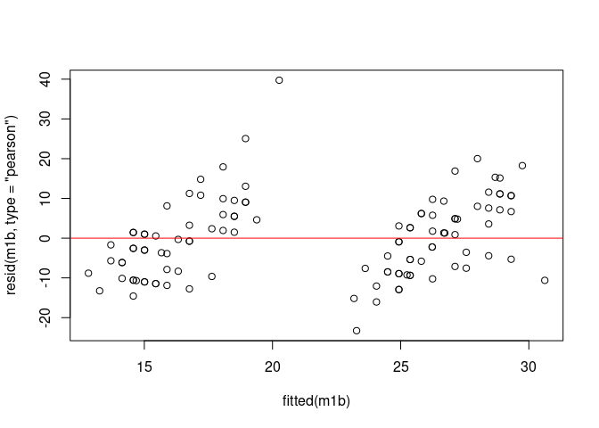

Importance of Visual Support Through Lipreading in the Identification of
Words in Spanish Language
================
Violeta Gómez-Vicente, Gema Esquiva, Carmen Lancho, Kawthar Benzerdjeb,
Antonia Angulo Jerez and Eva Ausó

``` r
## Libraries
library(dplyr)
library(ggplot2)
library(lme4)
library(lmerTest)
library(tidyverse)
library(emmeans)
library(optimx)
library(ggsignif)
library(car)
```

## Dataset

A cross-sectional observational study was conducted with normal-hearing
young and old adult volunteers of two genders, males and females, in
which we assessed the degree of discrimination of words and phonemes
following two protocols: auditory-only (*A*) and audiovisual (*AV*)
modalities. The study involved 65 participants, from 18 to 65 years of
age. The sample was divided into four groups according to age (18-29,
30-39, 40-49 and ≥ 50 years). It is a sample of a normal-hearing
population. All participants belonged to the University of Alicante
community and included undergraduate and master’s students, as well as
teaching/research and administrative staff, who were recruited between
February 2021 and June 2021 in Alicante, Spain. Eligible subjects were
contacted by email with the assistance of the Faculties of Sciences and
Health Sciences, who spread the message requesting participation among
their members. Inclusion criteria were a minimum age of 18 years,
bilateral normal hearing, normal or corrected vision, no prior training
in speechreading fluency in Spanish language (native speakers), and
non-existence of neurological or language-related disorders. The study
took place at the Audiology Laboratory of the University of Alicante. An
informed written consent was obtained from all participants and the
study was approved by the University Ethics Committee (approval number
UA-2021-02-12) and conducted in accordance with the Declaration of
Helsinki.

The dataset contains the following variables:

-   Subject: ID of the different volunteers
-   Age: categorical variable with 4 categories (18-29, 30-39, 40-49 and
    ≥ 50 years)
-   Gender: categorical variable with 2 categories (female, male)
-   Audio_AudioVisual: categorical variable with two categories
    (auditory-only *A*, audiovisual *AV*)
-   Word_Phoneme: categorical variable with two categories (word *W*,
    phoneme *P*)
-   Percent_accuracy: percentage of hit over the phonemes and word
    tested
-   Type_Protocol_WP: combination of the categorical variables
    *Protocol* and *Word_Phoneme*. It has four categories: words with
    auditory-only *A(W)*, phonemes with auditory-only *A(P)*, words with
    audiovisual *AV(W)*, phonemes with audiovisual *AV(P)*.

There are 4 values of percent accuracy per subject, each of them
corresponding to the levels of the variable *Type_Protocol_WP*. In
addition, there are some missing observations.

To analyze if there exists significant differences between the
categories of *Word_Phoneme* and *Audio_AudioVisual*, how are these
differences when including the gender or the age factor and to know
which is the audiovisual benefit between words and phonemes generalized
and linear mixed-effects model (GLMEM and LMEM) will be employed. In
particular, the maximal random-effect structure is contemplated to take
into account the variability associated with the selection of words and
phonemes that subjects hear.

## Percent accuracy and percent accuracy by gender and age

Given that some of the instances present missing values, a complete
maximal mixed-effects model cannot be considered since the number of
random effects is greater than the number of observations. Thus, only
the random intercept will be included. Seeking to have robust models
with the minimum no significant factors, the quadruple interaction with
*Word_Phoneme*, *Audio_AudioVisual*, *Gender* and *Age* is not
considered (this interactions implies 32 factors in the model). Hence,
two models are fitted: one considering the interaction between
*Word_Phoneme*, *Audio_AudioVisual* and *Gender* and one with the
interaction between *Word_Phoneme*, *Audio_AudioVisual* and *Age*. The
code of both models is now presented:

``` r
datos = datos %>% mutate(target = Percent_accuracy/100)
datos$weights_v = rep(25,dim(datos)[1])
datos_aux = na.omit(datos)

# Model including the interaction with Gender
m1a = glmer(target ~ 1 + Audio_AudioVisual*Word_Phoneme*Gender + Age +
              (1 | Subject), datos_aux,
            family = binomial, weights = weights_v,glmerControl(optimizer ='optimx', optCtrl=list(method='nlminb')))


# Model including the interaction with Age
m1a_age = glmer(target ~ 1 + Audio_AudioVisual*Word_Phoneme*Age + Gender +
              (1 | Subject), datos_aux,
            family = binomial, weights = weights_v,glmerControl(optimizer ='optimx', optCtrl=list(method='nlminb')))
```

Summary of the model including the interaction between
*Audio_AudioVisual*, *Word_Phoneme* and *Gender*:

``` r
summary(m1a)
```

    ## Generalized linear mixed model fit by maximum likelihood (Laplace
    ##   Approximation) [glmerMod]
    ##  Family: binomial  ( logit )
    ## Formula: target ~ 1 + Audio_AudioVisual * Word_Phoneme * Gender + Age +  
    ##     (1 | Subject)
    ##    Data: datos_aux
    ## Weights: weights_v
    ## Control: glmerControl(optimizer = "optimx", optCtrl = list(method = "nlminb"))
    ## 
    ##      AIC      BIC   logLik deviance df.resid 
    ##   1159.8   1201.5   -567.9   1135.8      227 
    ## 
    ## Scaled residuals: 
    ##     Min      1Q  Median      3Q     Max 
    ## -4.2438 -0.6143  0.0154  0.6229  2.5204 
    ## 
    ## Random effects:
    ##  Groups  Name        Variance Std.Dev.
    ##  Subject (Intercept) 0.1772   0.421   
    ## Number of obs: 239, groups:  Subject, 62
    ## 
    ## Fixed effects:
    ##                                              Estimate Std. Error z value
    ## (Intercept)                                  -0.64187    0.14267  -4.499
    ## Audio_AudioVisualAV                           1.18767    0.10605  11.199
    ## Word_PhonemeW                                 1.99442    0.11337  17.593
    ## GenderMale                                   -0.04771    0.15718  -0.304
    ## Age30-39                                     -0.09998    0.18099  -0.552
    ## Age40-49                                      0.02767    0.17403   0.159
    ## Age≥50                                       -0.33226    0.16862  -1.970
    ## Audio_AudioVisualAV:Word_PhonemeW            -0.06607    0.18224  -0.363
    ## Audio_AudioVisualAV:GenderMale               -0.08446    0.15720  -0.537
    ## Word_PhonemeW:GenderMale                     -0.28075    0.16675  -1.684
    ## Audio_AudioVisualAV:Word_PhonemeW:GenderMale -0.11405    0.25893  -0.440
    ##                                              Pr(>|z|)    
    ## (Intercept)                                  6.82e-06 ***
    ## Audio_AudioVisualAV                           < 2e-16 ***
    ## Word_PhonemeW                                 < 2e-16 ***
    ## GenderMale                                     0.7615    
    ## Age30-39                                       0.5807    
    ## Age40-49                                       0.8736    
    ## Age≥50                                         0.0488 *  
    ## Audio_AudioVisualAV:Word_PhonemeW              0.7169    
    ## Audio_AudioVisualAV:GenderMale                 0.5911    
    ## Word_PhonemeW:GenderMale                       0.0922 .  
    ## Audio_AudioVisualAV:Word_PhonemeW:GenderMale   0.6596    
    ## ---
    ## Signif. codes:  0 '***' 0.001 '**' 0.01 '*' 0.05 '.' 0.1 ' ' 1
    ## 
    ## Correlation of Fixed Effects:
    ##              (Intr) Ad_AVAV Wrd_PW GndrMl A30-39 A40-49 Age≥50 Ad_AVAV:W_PW
    ## Aud_AdVslAV  -0.366                                                        
    ## Word_PhonmW  -0.366  0.479                                                 
    ## GenderMale   -0.433  0.344   0.328                                         
    ## Age30-39     -0.514 -0.014   0.003 -0.100                                  
    ## Age40-49     -0.573 -0.007   0.014 -0.022  0.460                           
    ## Age≥50       -0.551 -0.019  -0.004 -0.101  0.488  0.494                    
    ## Ad_AVAV:W_PW  0.223 -0.580  -0.613 -0.202  0.000 -0.003 -0.001             
    ## Ad_AdVAV:GM   0.244 -0.674  -0.321 -0.515  0.012  0.014  0.010  0.391      
    ## Wrd_PhnW:GM   0.253 -0.325  -0.677 -0.488 -0.008 -0.008 -0.011  0.417      
    ## A_AVAV:W_PW: -0.155  0.408   0.431  0.313 -0.001 -0.003  0.000 -0.704      
    ##              A_AVAV:G W_PW:G
    ## Aud_AdVslAV                 
    ## Word_PhonmW                 
    ## GenderMale                  
    ## Age30-39                    
    ## Age40-49                    
    ## Age≥50                      
    ## Ad_AVAV:W_PW                
    ## Ad_AdVAV:GM                 
    ## Wrd_PhnW:GM   0.487         
    ## A_AVAV:W_PW: -0.605   -0.634

We first check the interaction between *Audio_AudioVisual* and
*Word_Phoneme* with the interaction plot. As the graph reveals, the
interaction is not significant. However, it can be appreciate that
phonemes benefit more from the audiovisual modality than words.

``` r
emmip(m1a,Audio_AudioVisual~Word_Phoneme, type='response') +
  theme(text = element_text(size=12)) + theme_bw() + 
  scale_color_manual(values=c("#808B96", "#17202A")) + ggtitle("Figure 1B") +
  xlab("Lists") + ylab("Predicted probability of accuracy") +  labs(color = "Modality")
```

<!-- -->

Now, the confidence intervals for *Audio_AudioVisual* and *Word_Phoneme*
and the statiscal comparison between their levels are performed.

``` r
emm_a_av = emmeans(m1a, ~ Audio_AudioVisual,type = 'response',df = df.residual(m1a))
emm_w_p = emmeans(m1a, ~ Word_Phoneme,type = 'response',df = df.residual(m1a))
emm_a_av
```

    ##  Audio_AudioVisual  prob     SE  df lower.CL upper.CL
    ##  A                 0.540 0.0169 227    0.506    0.573
    ##  AV                0.776 0.0128 227    0.750    0.801
    ## 
    ## Results are averaged over the levels of: Word_Phoneme, Gender, Age 
    ## Degrees-of-freedom method: user-specified 
    ## Confidence level used: 0.95 
    ## Intervals are back-transformed from the logit scale

``` r
emm_w_p
```

    ##  Word_Phoneme  prob     SE  df lower.CL upper.CL
    ##  P            0.452 0.0166 227    0.419    0.484
    ##  W            0.832 0.0106 227    0.810    0.852
    ## 
    ## Results are averaged over the levels of: Audio_AudioVisual, Gender, Age 
    ## Degrees-of-freedom method: user-specified 
    ## Confidence level used: 0.95 
    ## Intervals are back-transformed from the logit scale

``` r
# Multiple comparisons 
pairs(emm_a_av)
```

    ##  contrast odds.ratio    SE  df null t.ratio p.value
    ##  A / AV        0.338 0.022 227    1 -16.683  <.0001
    ## 
    ## Results are averaged over the levels of: Word_Phoneme, Gender, Age 
    ## Degrees-of-freedom method: user-specified 
    ## Tests are performed on the log odds ratio scale

``` r
pairs(emm_w_p)
```

    ##  contrast odds.ratio    SE  df null t.ratio p.value
    ##  P / W         0.167 0.011 227    1 -27.239  <.0001
    ## 
    ## Results are averaged over the levels of: Audio_AudioVisual, Gender, Age 
    ## Degrees-of-freedom method: user-specified 
    ## Tests are performed on the log odds ratio scale

The confidence intervals for the four types of protocol *A(W)*,
*AV(W)*,*A(P)*, *AV(P)* are:

``` r
# Confidence intervals:
emm = emmeans(m1a, ~ Audio_AudioVisual*Word_Phoneme,type = 'response',df = df.residual(m1a))
emm
```

    ##  Audio_AudioVisual Word_Phoneme  prob      SE  df lower.CL upper.CL
    ##  A                 P            0.317 0.01695 227    0.285    0.351
    ##  AV                P            0.594 0.01860 227    0.556    0.630
    ##  A                 W            0.748 0.01540 227    0.716    0.777
    ##  AV                W            0.892 0.00966 227    0.871    0.909
    ## 
    ## Results are averaged over the levels of: Gender, Age 
    ## Degrees-of-freedom method: user-specified 
    ## Confidence level used: 0.95 
    ## Intervals are back-transformed from the logit scale

There exists significant differences among all the four protocols
*A(W)*, *AV(W)*,*A(P)*, *AV(P)* (p-value \<.0001 in all cases). The
effects size (odds ratios) are also displayed.

``` r
# Multiple comparisons 
pairs(emm)
```

    ##  contrast    odds.ratio      SE  df null t.ratio p.value
    ##  A P / AV P      0.3181 0.02504 227    1 -14.553  <.0001
    ##  A P / A W       0.1566 0.01310 227    1 -22.166  <.0001
    ##  A P / AV W      0.0563 0.00573 227    1 -28.263  <.0001
    ##  AV P / A W      0.4923 0.04044 227    1  -8.628  <.0001
    ##  AV P / AV W     0.1771 0.01775 227    1 -17.268  <.0001
    ##  A W / AV W      0.3598 0.03709 227    1  -9.916  <.0001
    ## 
    ## Results are averaged over the levels of: Gender, Age 
    ## Degrees-of-freedom method: user-specified 
    ## P value adjustment: tukey method for comparing a family of 4 estimates 
    ## Tests are performed on the log odds ratio scale

Next, the figure 1A is plotted adding the detail (with letters a, b, c,
d) of the significant differences among categories:

``` r
##  Figure 1 A
datos$Type_Protocol_WP <- factor(datos$Type_Protocol_WP , levels=c("A(W)", "AV(W)","A(P)", "AV(P)"))
datos.summarized = datos %>% group_by(Type_Protocol_WP) %>% summarize(Max_value=max(Percent_accuracy,na.rm = TRUE))
signi_letters = c('a','b','c','d') # based on the previous multiple comparisons


set.seed(1)
ggplot(datos, aes(x = Type_Protocol_WP, y = Percent_accuracy)) + 
  geom_boxplot(outlier.shape = NA) + geom_point(position = position_jitter(height = 0, width=0.3), alpha=0.2)  +
  ggtitle("Figure 1A") +
  xlab("Protocol") + ylab("Percent accuracy")  + theme_bw() +
  theme(text = element_text(size=12)) + 
  geom_text(data=datos.summarized,
            aes(x=Type_Protocol_WP,y=0.2+Max_value,label=signi_letters),vjust=-0.4) 
```

<!-- -->

The following chunk obtains the confidence intervals of each gender
(female, male) inside the categories *A(W)*, *AV(W)*,*A(P)*, *AV(P)*.

``` r
# Confidence intervals 
#emm = emmeans(m1a, ~ Gender|Audio_AudioVisual*Word_Phoneme, by = 'Type_Protocol_WP', type = 'response',
#              df = df.residual(m1a))
emm = emmeans(m1a, ~ Gender|Audio_AudioVisual*Word_Phoneme, type = 'response',
              df = df.residual(m1a))
emm
```

    ## Audio_AudioVisual = A, Word_Phoneme = P:
    ##  Gender  prob     SE  df lower.CL upper.CL
    ##  Female 0.322 0.0231 227    0.279    0.369
    ##  Male   0.312 0.0249 227    0.265    0.363
    ## 
    ## Audio_AudioVisual = AV, Word_Phoneme = P:
    ##  Gender  prob     SE  df lower.CL upper.CL
    ##  Female 0.609 0.0249 227    0.559    0.657
    ##  Male   0.577 0.0277 227    0.522    0.631
    ## 
    ## Audio_AudioVisual = A, Word_Phoneme = W:
    ##  Gender  prob     SE  df lower.CL upper.CL
    ##  Female 0.778 0.0192 227    0.737    0.813
    ##  Male   0.716 0.0245 227    0.665    0.761
    ## 
    ## Audio_AudioVisual = AV, Word_Phoneme = W:
    ##  Gender  prob     SE  df lower.CL upper.CL
    ##  Female 0.915 0.0112 227    0.890    0.934
    ##  Male   0.864 0.0165 227    0.828    0.893
    ## 
    ## Results are averaged over the levels of: Age 
    ## Degrees-of-freedom method: user-specified 
    ## Confidence level used: 0.95 
    ## Intervals are back-transformed from the logit scale

The multiple comparisons analysis reveals that there are significant
differences between the percent accuracy of females and males in the
category *A(W)* (p-value = 0.0465) and in the category *AV(W)* (p-value
= 0.0092).

``` r
# Multiple comparisons 
#pairs(emm)
pairs(emm, simple = "each")$`simple contrasts for Gender`
```

    ## Audio_AudioVisual = A, Word_Phoneme = P:
    ##  contrast      odds.ratio    SE  df null t.ratio p.value
    ##  Female / Male       1.05 0.165 227    1   0.304  0.7617
    ## 
    ## Audio_AudioVisual = AV, Word_Phoneme = P:
    ##  contrast      odds.ratio    SE  df null t.ratio p.value
    ##  Female / Male       1.14 0.177 227    1   0.854  0.3941
    ## 
    ## Audio_AudioVisual = A, Word_Phoneme = W:
    ##  contrast      odds.ratio    SE  df null t.ratio p.value
    ##  Female / Male       1.39 0.228 227    1   2.002  0.0465
    ## 
    ## Audio_AudioVisual = AV, Word_Phoneme = W:
    ##  contrast      odds.ratio    SE  df null t.ratio p.value
    ##  Female / Male       1.69 0.340 227    1   2.628  0.0092
    ## 
    ## Results are averaged over the levels of: Age 
    ## Degrees-of-freedom method: user-specified 
    ## Tests are performed on the log odds ratio scale

The two following plot helps in the comparison of the gender levels in
the categories *A(W)*, *AV(W)*,*A(P)*, *AV(P)*.

``` r
# Boxplot
set.seed(100)
ggplot(datos, aes(x = Type_Protocol_WP, y = Percent_accuracy,
                  color = Gender)) +  
  geom_boxplot(outlier.shape = NA)+ 
  geom_point(position = position_jitterdodge(), alpha=0.5)  +
ggtitle("Figure 2") +
  xlab("Protocol") + ylab("Percent accuracy")  + theme_bw() +
  theme(text = element_text(size=17)) +
  scale_fill_grey(start=0.8, end=0.6) +
  geom_signif(annotation = "✳",
              y_position = 105, xmin = 0.81, xmax = 1.19, 
              tip_length = 0.01, color = 'dimgray') +
  geom_signif(annotation = "✳",
              y_position = 105, xmin = 1.81, xmax = 2.19, 
              tip_length = 0.01, color = 'dimgray')+ theme_bw() +
  scale_color_manual(values=c("#808B96", "#17202A"))
```

<!-- -->

To analyze the effect of the age, the model considering the interaction
with age is used. First, a summary of the model is presented.

``` r
summary(m1a_age)
```

    ## Generalized linear mixed model fit by maximum likelihood (Laplace
    ##   Approximation) [glmerMod]
    ##  Family: binomial  ( logit )
    ## Formula: target ~ 1 + Audio_AudioVisual * Word_Phoneme * Age + Gender +  
    ##     (1 | Subject)
    ##    Data: datos_aux
    ## Weights: weights_v
    ## Control: glmerControl(optimizer = "optimx", optCtrl = list(method = "nlminb"))
    ## 
    ##      AIC      BIC   logLik deviance df.resid 
    ##   1165.7   1228.3   -564.9   1129.7      221 
    ## 
    ## Scaled residuals: 
    ##     Min      1Q  Median      3Q     Max 
    ## -4.8060 -0.5783 -0.0235  0.6755  2.4838 
    ## 
    ## Random effects:
    ##  Groups  Name        Variance Std.Dev.
    ##  Subject (Intercept) 0.1764   0.42    
    ## Number of obs: 239, groups:  Subject, 62
    ## 
    ## Fixed effects:
    ##                                            Estimate Std. Error z value Pr(>|z|)
    ## (Intercept)                                -0.69362    0.15709  -4.416 1.01e-05
    ## Audio_AudioVisualAV                         1.22058    0.15461   7.895 2.91e-15
    ## Word_PhonemeW                               2.20376    0.17153  12.848  < 2e-16
    ## Age30-39                                   -0.10220    0.22831  -0.448   0.6544
    ## Age40-49                                    0.24834    0.21507   1.155   0.2482
    ## Age≥50                                     -0.09082    0.21269  -0.427   0.6694
    ## GenderMale                                 -0.20401    0.12547  -1.626   0.1040
    ## Audio_AudioVisualAV:Word_PhonemeW          -0.37606    0.27004  -1.393   0.1637
    ## Audio_AudioVisualAV:Age30-39                0.24258    0.23064   1.052   0.2929
    ## Audio_AudioVisualAV:Age40-49               -0.30514    0.21990  -1.388   0.1653
    ## Audio_AudioVisualAV:Age≥50                 -0.18388    0.21361  -0.861   0.3893
    ## Word_PhonemeW:Age30-39                     -0.31557    0.24663  -1.280   0.2007
    ## Word_PhonemeW:Age40-49                     -0.41991    0.24179  -1.737   0.0824
    ## Word_PhonemeW:Age≥50                       -0.54378    0.22910  -2.374   0.0176
    ## Audio_AudioVisualAV:Word_PhonemeW:Age30-39  0.05193    0.38588   0.135   0.8929
    ## Audio_AudioVisualAV:Word_PhonemeW:Age40-49  0.51273    0.38469   1.333   0.1826
    ## Audio_AudioVisualAV:Word_PhonemeW:Age≥50    0.37115    0.35296   1.052   0.2930
    ##                                               
    ## (Intercept)                                ***
    ## Audio_AudioVisualAV                        ***
    ## Word_PhonemeW                              ***
    ## Age30-39                                      
    ## Age40-49                                      
    ## Age≥50                                        
    ## GenderMale                                    
    ## Audio_AudioVisualAV:Word_PhonemeW             
    ## Audio_AudioVisualAV:Age30-39                  
    ## Audio_AudioVisualAV:Age40-49                  
    ## Audio_AudioVisualAV:Age≥50                    
    ## Word_PhonemeW:Age30-39                        
    ## Word_PhonemeW:Age40-49                     .  
    ## Word_PhonemeW:Age≥50                       *  
    ## Audio_AudioVisualAV:Word_PhonemeW:Age30-39    
    ## Audio_AudioVisualAV:Word_PhonemeW:Age40-49    
    ## Audio_AudioVisualAV:Word_PhonemeW:Age≥50      
    ## ---
    ## Signif. codes:  0 '***' 0.001 '**' 0.01 '*' 0.05 '.' 0.1 ' ' 1

The confidence intervals of each age category inside the categories
*A(W)*, *AV(W)*,*A(P)*, *AV(P)* are:

``` r
emm = emmeans(m1a_age, ~ Age|Audio_AudioVisual*Word_Phoneme, type = 'response',
              df = df.residual(m1a))
emm
```

    ## Audio_AudioVisual = A, Word_Phoneme = P:
    ##  Age    prob     SE  df lower.CL upper.CL
    ##  18-29 0.311 0.0325 227    0.251    0.378
    ##  30-39 0.289 0.0350 227    0.226    0.363
    ##  40-49 0.366 0.0358 227    0.299    0.439
    ##  ≥50   0.292 0.0308 227    0.235    0.356
    ## 
    ## Audio_AudioVisual = AV, Word_Phoneme = P:
    ##  Age    prob     SE  df lower.CL upper.CL
    ##  18-29 0.605 0.0363 227    0.531    0.674
    ##  30-39 0.638 0.0382 227    0.560    0.709
    ##  40-49 0.591 0.0379 227    0.515    0.663
    ##  ≥50   0.537 0.0354 227    0.467    0.606
    ## 
    ## Audio_AudioVisual = A, Word_Phoneme = W:
    ##  Age    prob     SE  df lower.CL upper.CL
    ##  18-29 0.803 0.0263 227    0.747    0.850
    ##  30-39 0.729 0.0339 227    0.657    0.791
    ##  40-49 0.775 0.0298 227    0.711    0.828
    ##  ≥50   0.684 0.0318 227    0.619    0.743
    ## 
    ## Audio_AudioVisual = AV, Word_Phoneme = W:
    ##  Age    prob     SE  df lower.CL upper.CL
    ##  18-29 0.905 0.0180 227    0.863    0.935
    ##  30-39 0.894 0.0201 227    0.847    0.927
    ##  40-49 0.908 0.0180 227    0.866    0.938
    ##  ≥50   0.859 0.0208 227    0.813    0.895
    ## 
    ## Results are averaged over the levels of: Gender 
    ## Degrees-of-freedom method: user-specified 
    ## Confidence level used: 0.95 
    ## Intervals are back-transformed from the logit scale

The multiple comparisons analysis shows that there are only significant
differences between the percent accuracy of the category (18-29) and ≥50
in the category *A(W)* (p-value = 0.0243).

``` r
# Multiple comparisons 
pairs(emm, simple = "each")$`simple contrasts for Age`
```

    ## Audio_AudioVisual = A, Word_Phoneme = P:
    ##  contrast          odds.ratio    SE  df null t.ratio p.value
    ##  (18-29) / (30-39)      1.108 0.253 227    1   0.448  0.9700
    ##  (18-29) / (40-49)      0.780 0.168 227    1  -1.155  0.6560
    ##  (18-29) / ≥50          1.095 0.233 227    1   0.427  0.9738
    ##  (30-39) / (40-49)      0.704 0.162 227    1  -1.524  0.4246
    ##  (30-39) / ≥50          0.989 0.224 227    1  -0.050  1.0000
    ##  (40-49) / ≥50          1.404 0.301 227    1   1.581  0.3914
    ## 
    ## Audio_AudioVisual = AV, Word_Phoneme = P:
    ##  contrast          odds.ratio    SE  df null t.ratio p.value
    ##  (18-29) / (30-39)      0.869 0.195 227    1  -0.624  0.9243
    ##  (18-29) / (40-49)      1.058 0.230 227    1   0.261  0.9937
    ##  (18-29) / ≥50          1.316 0.274 227    1   1.317  0.5528
    ##  (30-39) / (40-49)      1.218 0.278 227    1   0.864  0.8233
    ##  (30-39) / ≥50          1.514 0.331 227    1   1.901  0.2303
    ##  (40-49) / ≥50          1.243 0.264 227    1   1.028  0.7335
    ## 
    ## Audio_AudioVisual = A, Word_Phoneme = W:
    ##  contrast          odds.ratio    SE  df null t.ratio p.value
    ##  (18-29) / (30-39)      1.519 0.364 227    1   1.745  0.3032
    ##  (18-29) / (40-49)      1.187 0.282 227    1   0.723  0.8878
    ##  (18-29) / ≥50          1.886 0.419 227    1   2.854  0.0242
    ##  (30-39) / (40-49)      0.782 0.189 227    1  -1.016  0.7404
    ##  (30-39) / ≥50          1.242 0.281 227    1   0.959  0.7726
    ##  (40-49) / ≥50          1.589 0.358 227    1   2.053  0.1720
    ## 
    ## Audio_AudioVisual = AV, Word_Phoneme = W:
    ##  contrast          odds.ratio    SE  df null t.ratio p.value
    ##  (18-29) / (30-39)      1.131 0.337 227    1   0.414  0.9761
    ##  (18-29) / (40-49)      0.965 0.289 227    1  -0.120  0.9994
    ##  (18-29) / ≥50          1.564 0.423 227    1   1.653  0.3509
    ##  (30-39) / (40-49)      0.853 0.258 227    1  -0.527  0.9525
    ##  (30-39) / ≥50          1.383 0.377 227    1   1.189  0.6346
    ##  (40-49) / ≥50          1.622 0.447 227    1   1.754  0.2982
    ## 
    ## Results are averaged over the levels of: Gender 
    ## Degrees-of-freedom method: user-specified 
    ## P value adjustment: tukey method for comparing a family of 4 estimates 
    ## Tests are performed on the log odds ratio scale

The two following plot helps in the comparison of the age levels in the
categories *A(W)*, *AV(W)*,*A(P)*, *AV(P)*.

``` r
set.seed(1)
ggplot(datos, aes(x = Type_Protocol_WP, y = Percent_accuracy,
                  color = Age)) +  
  geom_boxplot(outlier.shape = NA)+ 
  geom_point(position = position_jitterdodge(jitter.height = 0), alpha=0.6)  +
  ggtitle("Figure 3") +
  xlab("Protocol") + ylab("Percent accuracy")   + theme_bw() +
  theme(text = element_text(size=17)) +
  scale_fill_grey(start=0.85, end=0.38) +
  geom_signif(annotation = "✳",
              y_position = 105, xmin = 0.71, xmax = 1.29, 
              tip_length = 0.01, color = 'dimgray') + theme_bw() +
  scale_color_manual(values=c("#ABB2B9","#898989", "#4B4B4B", "#000000"))
```

<!-- -->

Finally, we check the residuals of the two employed models. In both
cases, all the conditions are fulfilled.

``` r
### Residual Checks for the model with gender interaction
plot(fitted(m1a), resid(m1a, type = "pearson"))
abline(0,0, col="red")
```

<!-- -->

``` r
qqnorm(resid(m1a)) 
qqline(resid(m1a), col = "red") 
```

<!-- -->

``` r
# random intercept subject
qqnorm(ranef(m1a)$Subject[,1] )
qqline(ranef(m1a)$Subject[,1], col = "red")
```

<!-- -->

``` r
### Residual Checks for the model with age interaction
plot(fitted(m1a_age), resid(m1a_age, type = "pearson"))
abline(0,0, col="red")
```

<!-- -->

``` r
qqnorm(resid(m1a_age)) 
qqline(resid(m1a_age), col = "red") 
```

<!-- -->

``` r
# random intercept subject
qqnorm(ranef(m1a_age)$Subject[,1] )
qqline(ranef(m1a_age)$Subject[,1], col = "red")
```

<!-- -->

## Audiovisual benefit

We analyze if there is significant differences between the Audiovisual
(AV) benefit in the word (W) and phoneme (P) categories. AV benefit was
gauged as the difference in the percent accuracy in the two lists (words
and phonemes) between AV and A modalities. First, a linear mixed-effects
model is tested. If the hypothesis (normality and homoscedasticity of
the residuals) are not fulfilled, a non-parametric model will be
employed.

Given that some of the instances present missing values, a complete
maximal mixed-effects model cannot be considered since the number of
random effects is greater than the number of observations. Thus, only
the random intercept will be included as it can be seen in the following
chunk:

``` r
data_1b = na.omit(datos_av)
m1b = lmer(AV_benefit ~ 1 + Word_Phoneme +
             (1 | Subject) , data_1b) 
summary(m1b)
```

    ## Linear mixed model fit by REML. t-tests use Satterthwaite's method [
    ## lmerModLmerTest]
    ## Formula: AV_benefit ~ 1 + Word_Phoneme + (1 | Subject)
    ##    Data: data_1b
    ## 
    ## REML criterion at convergence: 861.9
    ## 
    ## Scaled residuals: 
    ##     Min      1Q  Median      3Q     Max 
    ## -2.1867 -0.7977 -0.0713  0.5818  3.7326 
    ## 
    ## Random effects:
    ##  Groups   Name        Variance Std.Dev.
    ##  Subject  (Intercept)  15.88    3.985  
    ##  Residual             113.35   10.647  
    ## Number of obs: 113, groups:  Subject, 61
    ## 
    ## Fixed effects:
    ##               Estimate Std. Error      df t value Pr(>|t|)    
    ## (Intercept)     16.182      1.546 110.107  10.469  < 2e-16 ***
    ## Word_PhonemeP   10.360      2.015  56.397   5.142 3.54e-06 ***
    ## ---
    ## Signif. codes:  0 '***' 0.001 '**' 0.01 '*' 0.05 '.' 0.1 ' ' 1
    ## 
    ## Correlation of Fixed Effects:
    ##             (Intr)
    ## Word_PhonmP -0.684

Next, the residuals check is performed. The normality of the residuals
and of the random intercept is fulfilled. Besides, the homoscedasticity
is also satisfied as the residual graph and the Levene test show.

``` r
# homoscedasticity
plot(fitted(m1b), resid(m1b, type = "pearson"))
abline(0,0, col="red")
```

<!-- -->

``` r
leveneTest(residuals(m1b) ~ data_1b$Word_Phoneme)
```

    ## Levene's Test for Homogeneity of Variance (center = median)
    ##        Df F value Pr(>F)
    ## group   1  0.0298 0.8632
    ##       111

``` r
# Normality of residuals
qqnorm(resid(m1b)) 
qqline(resid(m1b), col = "red") 
```

<!-- -->

``` r
# Normality of random intercept subject
qqnorm(ranef(m1b)$Subject[,1] )
qqline(ranef(m1b)$Subject[,1], col = "red")
```

<!-- -->

Since all the hypotheses are accomplished, the maximal mixed-effects
model is validated. The variable *Word_Phoneme* is significant in the
model, meaning that there exists significant differences between the
category *Word (W)* and the category *Phoneme (P)*. With the help of the
*emmeans* package, the difference between categories is tested and the
confidence intervals are obtained.

The results imply that the *AudioVisual benefit* is significantly higher
for *Phonemes (P)* (p-value \<.0001).

``` r
# Test of the difference
emm = emmeans(m1b, ~ Word_Phoneme)
pairs(emm)
```

    ##  contrast estimate   SE   df t.ratio p.value
    ##  W - P       -10.4 2.02 57.1  -5.133  <.0001
    ## 
    ## Degrees-of-freedom method: kenward-roger

The effect size of the comparison is:

``` r
vari = as.data.frame(VarCorr(m1b))$vcov
sigma_model = sqrt(sum(vari))
eff_size(emm, sigma = sigma_model, edf = df.residual(m1b))
```

    ##  contrast effect.size    SE  df lower.CL upper.CL
    ##  W - P         -0.911 0.188 110    -1.28   -0.539
    ## 
    ## sigma used for effect sizes: 11.37 
    ## Degrees-of-freedom method: inherited from kenward-roger when re-gridding 
    ## Confidence level used: 0.95

The confidence interval *mean ± 1.98* $\cdot$ *se* for *Word (W)* is
16.2 ± 3.07 and the confidence interval for *Phoneme (P)* is 26.5 ±
2.93.

``` r
# Means and standard error, confidence interval
emm
```

    ##  Word_Phoneme emmean   SE  df lower.CL upper.CL
    ##  W              16.2 1.55 110     13.1     19.3
    ##  P              26.5 1.48 110     23.6     29.5
    ## 
    ## Degrees-of-freedom method: kenward-roger 
    ## Confidence level used: 0.95

The corresponding graph including the significant difference is now
plotted.

``` r
library(gridExtra)
library(grid)
data_1b$Word_Phoneme <- factor(data_1b$Word_Phoneme, levels=c("P", "W"))
g <-ggplot(data_1b, aes(x = Word_Phoneme, y = AV_benefit)) + 
  geom_boxplot(outlier.shape = NA) + geom_point(position = position_jitter(height = 0, width=0.3), alpha=0.2)  +
  ggtitle("Figure 1C") +
  xlab("Lists") + ylab("") + theme_bw()  +
  theme(text = element_text(size=12)) +
  geom_signif(comparisons = list(c("P", "W")), map_signif_level=TRUE,
              annotations = "✳✳✳✳",tip_length = 0.01, color = 'dimgray') +
  ylim(0, 65)

g2 <- grid.arrange(g, left = textGrob("(= AV percent accuracy - A percent accuracy)",  rot = 90, 
                                   x = 1.7, gp = gpar(fontsize = 9)))
```

``` r
grid.arrange(g2, 
             left = textGrob("% of AV benefit",  rot = 90, 
                             x = 1.6, gp = gpar(fontsize = 12)))
```

<!-- -->
